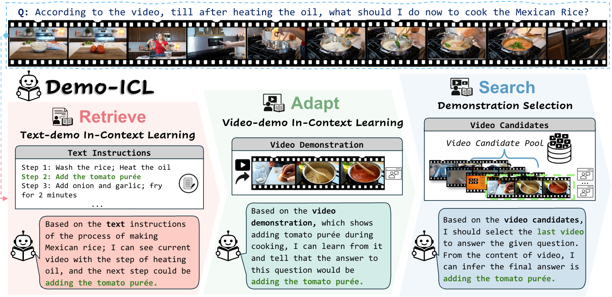
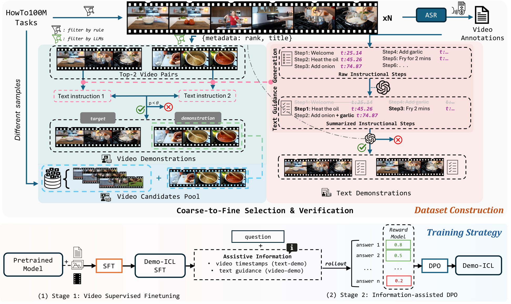
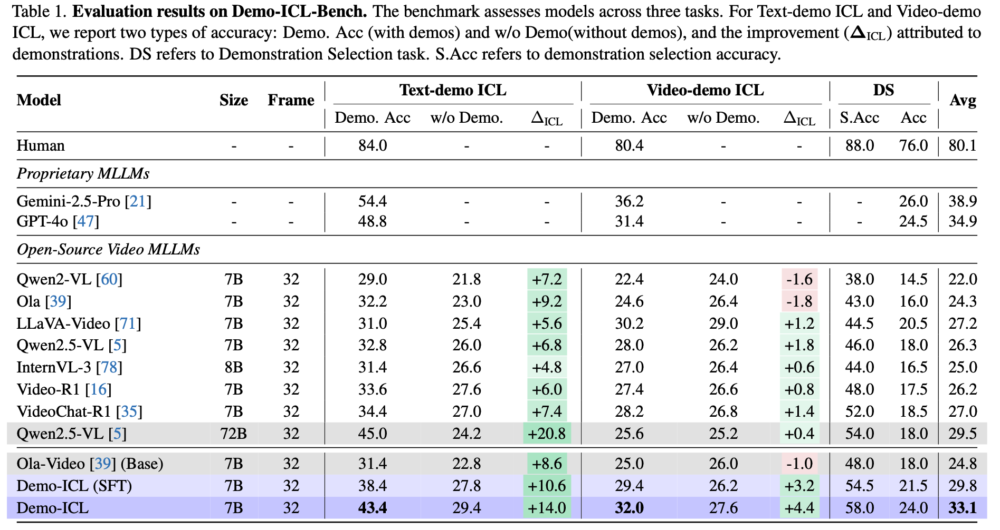
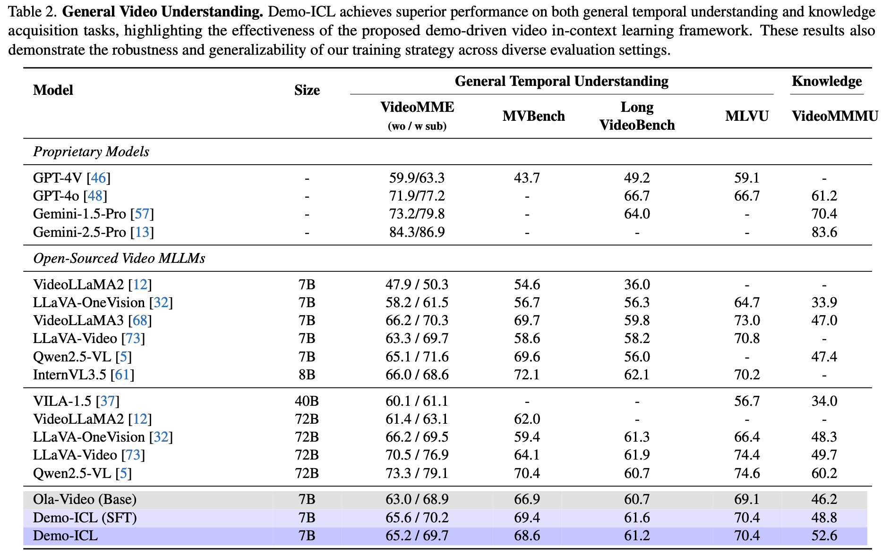
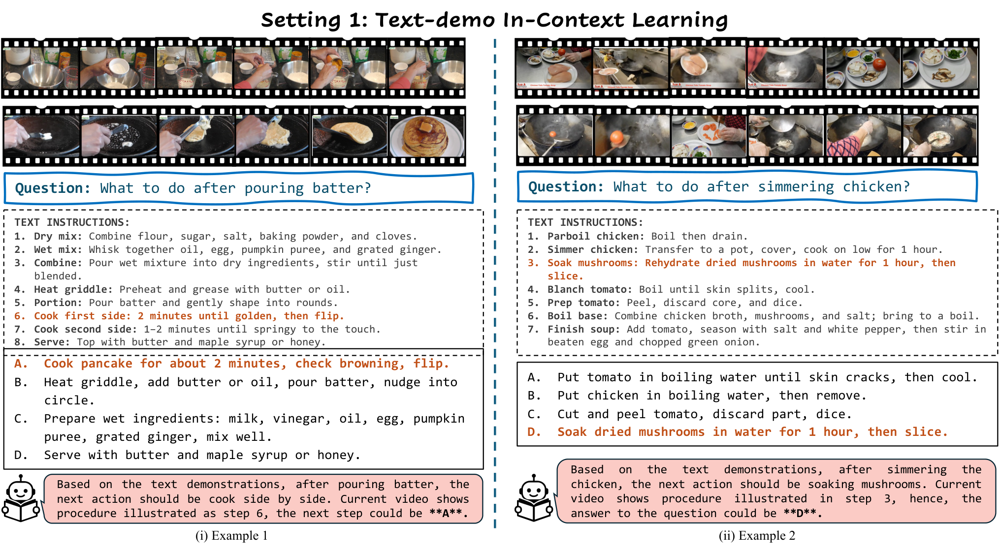
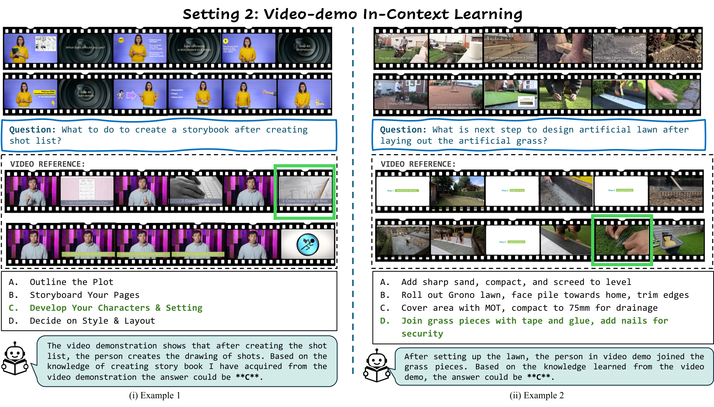

# Demo-ICL: In-Context Learning for Procedural Video Knowledge Acquisition

[](https://arxiv.org/abs/2602.XXXXX) 
[](https://github.com/Ola-Omni/Ola/blob/main/LICENSE)
[](https://huggingface.co/THUdyh/Demo-ICL)

**[Yuhao Dong](https://scholar.google.com/citations?user=kMui170AAAAJ)**<sup>1*</sup>, **[Shulin Tian](https://shulin16.github.io/)**<sup>1*</sup>, **[Shuai Liu](https://choiszt.github.io/)**<sup>1</sup>, **[Shuangrui Ding](https://mark12ding.github.io/)**<sup>2,3</sup>, **[Yuhang Zang](https://yuhangzang.github.io/)**<sup>2</sup>, **[Xiaoyi Dong]()**<sup>2</sup>, **[Yuhang Cao](https://scholar.google.com/citations?user=sJkqsqkAAAAJ)**<sup>2</sup>, **[Jiaqi Wang](https://myownskyw7.github.io/)**<sup>2</sup>, **[Ziwei Liu](https://liuziwei7.github.io/index.html)**<sup>1</sup>

<sup>1</sup>S-Lab, Nanyang Technological University&nbsp;&nbsp;&nbsp;
<sup>2</sup>Shanghai AI Lab&nbsp;&nbsp;&nbsp;
<sup>3</sup>CUHK-MMLab

<small>*Equal contribution</small>


## 📢 News

- **[2026-02-09]** 🚀 We release Demo-ICL!

## 📖 Introduction

**Demo-ICL** explores a challenging new frontier: **Demo-driven Video In-Context Learning**. While existing benchmarks rely on static, internal knowledge, Demo-ICL evaluates whether Multimodal Large Language Models (MLLMs) can acquire procedural knowledge *dynamically* from provided demonstrations (text or video) to solve novel tasks.

We introduce:
- **Demo-ICL-Bench**: A benchmark of **1,200** samples derived from HowTo100M instructional videos, requiring models to predict next steps based on context.
- **Demo-ICL Model (7B)**: Built on **Ola-Video**, this model utilizes a novel two-stage training strategy to achieve state-of-the-art performance in utilizing video demonstrations.

<p align="center">

</p>


## ⚙️ Tasks & Benchmark

**Demo-ICL-Bench** consists of three distinct settings designed to test adaptability:

1. **Text-demo ICL (500 samples):** The model must retrieve relevant procedure steps from textual instructions to predict the next action in a target video.
2. **Video-demo ICL (500 samples):** The model is provided with a reference video of a similar task and must transfer that visual procedural knowledge to the target video.
3. **Demonstration Selection (200 samples):** A realistic setting where the model must select from a candidate pool (containing distractors) to find the correct demonstration before solving the task.


## 🚀 Methodology

<p align="center">

</p>

### Dataset Construction

We construct **Demo-ICL-Bench** using a **coarse-to-fine pipeline** on HowTo100M, ensuring high-quality demonstrations:

* **Data Processing:** WhisperX provides precise timestamps, while Qwen2.5-72B summarizes transcripts into structured instructions, filtering irrelevant steps.
* **Demonstration Selection:** Video pairs are identified via search rankings (coarse) and validated by LLMs for semantic similarity (fine) to ensure transferability.

### Training Strategy

Our model, **Demo-ICL**, employs a two-stage strategy:

1. **Video SFT:** Fine-tuning **Ola-Video** on diverse video/image-text data to establish foundational understanding.
2. **Information-Assisted DPO:** A novel pipeline utilizing **assistive information** during training to align responses with human preferences, enabling accurate inference without auxiliary aids.
## 📊 Results

### Demo-Driven Capabilities

<p align="center">

</p>

Demo-ICL (7B) significantly outperforms existing open-source and proprietary models on Demo-ICL-Bench:

* **State-of-the-Art Performance:** Demo-ICL achieves an average accuracy of **33.1%**, surpassing Qwen2.5-VL-72B (29.5%) despite being 10x smaller.
* **Positive Transfer:** Unlike many baselines which degrade when given video demonstrations (negative $\Delta_{ICL}$), Demo-ICL achieves a **+4.4** improvement with video demos and **+14.0** with text demos.

### General Video Understanding

<p align="center">

</p>

Demo-ICL maintains robust performance on standard benchmarks, achieving **52.6% on VideoMMMU** (Knowledge Acquisition), surpassing Qwen2.5-VL-7B and LLaVA-OneVision-7B.

### Qualitative Results

<p align="center">

</p>
<p align="center"><em>Figure 2. Visualization of Text-demo In-Context Learning. Text instructions guide the model to identify the next procedural step in cooking tasks.</em></p>

<p align="center">

</p>
<p align="center"><em>Figure 3. Visualization of Video-demo In-Context Learning. A video demonstration provides visual procedural knowledge for the model to transfer to the target video.</em></p>

## ✏️ Citation

If you find this work useful, please cite our paper:

```bibtex
@article{dong2025demoicl,
  title={Demo-ICL: In-Context Learning for Procedural Video Knowledge Acquisition},
  author={Dong, Yuhao and Tian, Shulin and Liu, Shuai and Ding, Shuangrui and Zang, Yuhang and Dong, Xiaoyi and Cao, Yuhang and Wang, Jiaqi and Liu, Ziwei},
  journal={arXiv preprint arXiv:2602.XXXXX},
  year={2026}
}
```
## 🙏 Acknowledgements

**Demo-ICL** is built with reference to the code of the following projects: [Ola](https://github.com/Ola-Omni/Ola), [LLaVA-NeXT](https://github.com/LLaVA-VL/LLaVA-NeXT), [lmms-eval](https://github.com/EvolvingLMMs-Lab/lmms-eval), and [HowTo100M](https://www.di.ens.fr/willow/research/howto100m/). We thank the open-source community for their contributions.